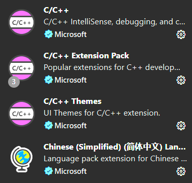
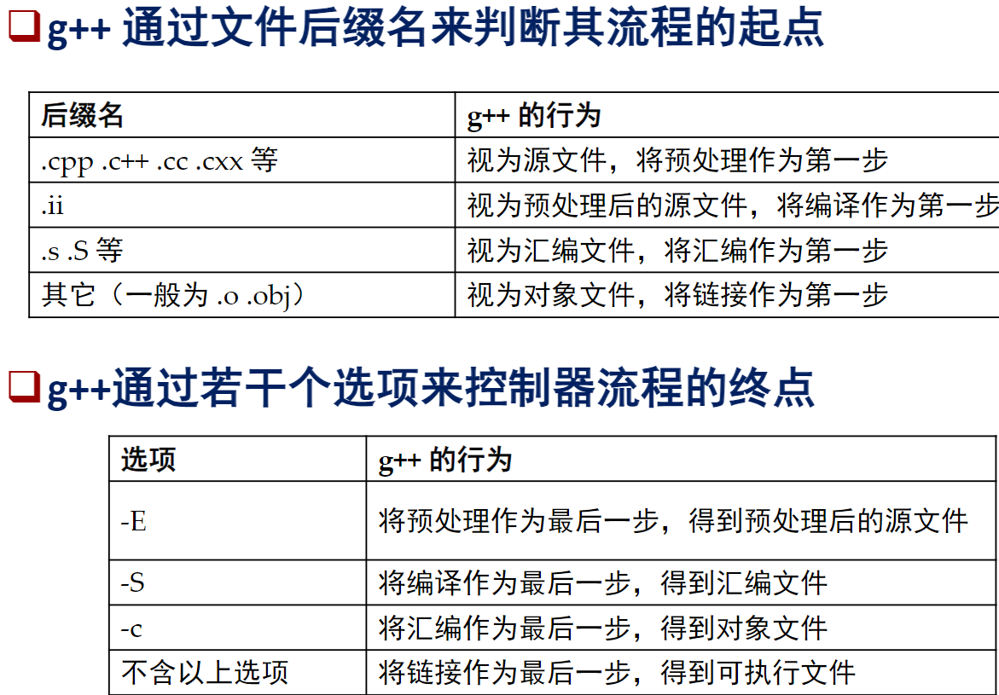

# vscode中的c/c++环境配置

## 前言

IDE（集成开发环境）几乎是开发者最常用的程序，当前市面上有不少c/c++的优质IDE，光Windows系统上就有VS、VScode、devc++等各种各样的IDE。这么多IDE如何选择，VS如此开箱即用，我们为什么要费力配置VScode？

首先VScode需要配置是因为它根本没有编译器，只是一个编辑器，类似于记事本。正是因此VScode几乎没有什么内容，相当的轻量化，存储空间友好。双胞胎兄弟VS动不动就是几十个G，而很多功能我们是一般用不上的。

而后，由于没有内置编译器或解释器，VScode可以手动配置各种各样的编程语言（作者目前的VScode有多套配置文件，已经可以支持C/C++、python、网页三件套、rust、latex或typst排版等分别独立开发以及混合开发了），每学一个新语言并不需要重新下载一个新的IDE。

什么都能写，未必写的比人家只会一种的好？没事，VScode最强大的功能在于其极为丰富的插件/拓展生态，无论是代码辅助、高亮显示、自动纠错等实用工具，还是IDE美化、布局设计等锦上添花，各式各样的插件你都能找到。VScode官方还有开发插件的指导文档，时间和精力充裕的情况下，你甚至可以自己写个独一无二的插件。

此外，生态的健全优秀会不断引来更多活水，git、docker、github等各种应用和平台的内嵌支持就不必说了，在AI时代越来越多的代码辅助AI不断出现，绝大多数产品都会推出支持VScode的版本，我们的IDE正在蒸蒸日上（doge）

总之，入门VScode确实需要一些时间和精力成本，但我觉得不亏！值得一试！

## 入门篇：能跑helloworld就算成功

### 第一步：安装VScode

建议尽量直接去[官网](https://code.visualstudio.com/)下载安装。

### 第二步：安装编译器g++

去[这个仓库](https://github.com/niXman/mingw-builds-binaries/releases)选择对应自己系统的版本，x86_64对应64位系统，i686对应32位系统。大多数同学一般下载x86_64-x.x.x-release-posix-seh-ucrt-rt_vxx-revx.7z（这里面的x基本替换数字，一般都是你下载时候发行出的最新版本）。

下载安装完后将其解压缩，并保存在一个你确定直到具体路径的地方，这个路径我们之后要用。注意：绝对路径（即以盘符为起点的路径）整个不要出现中文，否则可能会出现bug！

### 第三步：配置环境变量

我们希望编译器能够在电脑的任何一个目录下使用，所以需要将编译器的位置告诉电脑。

右键“此电脑”选择“属性”-高级系统设置，或直接按键盘windows徽标，搜索环境变量。在系统变量中有个名为Path的变量，双击打开，新建路径，将你刚才mingw文件夹中的bin目录的绝对路径加进去（下载路径\mingw64\bin），然后一路点击确定确定确定直到把所有设置窗口关闭。
- ps：到这一步，你可以测试一下是否成功：win+r，输入 `cmd` 调出命令行窗口，输入 `gcc -v` ，回车，如果出现了一堆gcc的版本信息就算是成功了。

### 第四步：Vscode内的操作

首先安装插件。点左边栏那个像俄罗斯方块图标，打开扩展，一般会安装如下插件：



在vscode中打开的项目目录新建一个.c/.cpp文件，写段helloworld代码。写完之后点击右上角运行的三角号。此时vscode上方会弹出调试程序的配置设置，.c文件选择gcc，.cpp文件选择g++，此时应该顺利的运行了程序（第一次运行或许有点慢，稍作等待）。如果你看到输出了helloworld，那么你的环境配置就基本成功啦！

### 第五步：关于json文件中参数的含义与设置（一些进阶设置，能用就行党不必掌握）

当你成功完成了第四步时，你的项目目录下应该自动创建了一个名为`.vscode`的文件夹，并且其中还有一个名为`tasks.json`的文件。将页面切换至你的.cpp文件并点击左侧的运行与调试按钮，你会看到蓝字“创建launch.json”，点击，并在上方弹出的选项中选择C++(GDB/LLDB)。进入`launch.json`，右下角点击添加配置，选择C/C++:(gdb)启动，会自动生成模板。此外，你可以自己在`.vscode`文件夹中新建名为`c_cpp_properties.json`和`settings.json`的文件，这两个文件不影响你的编译过程，而是影响你的编辑器对你的代码进行检查、理解、提示、警告等功能，是针对vscode的c/c++插件的设置。前者为插件提供了*头文件路径、编译器路径、宏定义、编译器目标平台*等信息，后者为插件提供了*代码格式化、智能提示、构建任务、调试配置、外观和编辑器行为*等方面的设置。（前者可以通过按Ctrl+Shift+p，输入Edit Configurations生成json文件）

下面我们来看一下各个.json文件中的常用到的重要参数的含义：

**task.json**

- command：编译器`gcc.exe`的路径。
- args：对编译器投入的参数与选项（相当于在命令行中输入`gcc xxxx`）。
    - -g后的是被编译的文件。
    - -o后的是生成的文件路径名。
    - $\{\}中间的内容是一些特定的宏，比如file是启动时所在的文件名，fileDirname是file所在的目录，fileBasenameNoExtension就如同字面意思是去掉了拓展名的file，workspaceFolder是当前工作目录等等。
    当你有多个文件（比如多个.c）文件需要编译时，可以将被编译的文件处写作"*.c"，表示编译所有的.c文件并链接起来成为一个.exe文件，当然也可以不直接到.exe而是按照预处理-编译-汇编-链接的次序一步步来，详细的请自行查阅C编译器的指令规则。

**launch.json**

- program：是编译后生成的可执行文件，即对应上述`task.json`中-o后的内容，一般设置为相同即可。
- externalConsole：只有true和false两个值，决定了程序运行时是以黑框框的外置控制台运行，还是通过vscode自带的内部终端运行。
- miDebuggerPath：编译器中`gdb.exe`工具的路径，这一工具一般和上述`task.json`中command对应的`gcc.exe`程序位于同一个目录下。

**c_cpp_properties.json**

- 一个针对Windows端的示例：
```json
{
  "configurations": [
    {
      "name": "Win32",
      "includePath": [
        "${workspaceFolder}/**",
        "C:/mingw64/lib/gcc/x86_64-w64-mingw32/8.1.0/include", // 编译器自带头文件路径（通常compilerPath会自动添加）
        "C:/mingw64/include" // MinGW 自带的头文件
      ],
      "defines": [
        "_DEBUG",
        "UNICODE"
      ],
      "compilerPath": "C:/mingw64/bin/gcc.exe", // 设置后很多路径会自动填充
      "cStandard": "c17",
      "cppStandard": "c++17",
      "intelliSenseMode": "windows-gcc-x64"
    }
  ],
  "version": 4
}
```
- configurations: 一个数组，允许你为不同的平台或环境（如 Linux、Windows、Mac）创建不同的配置。VSCode 会根据你当前的操作系统自动选择匹配的 "name"。
- name: 配置的名称，例如 "Win32", "Linux-GCC", "Mac-Clang"。
- includePath: 最重要的设置之一。它是一个路径列表，告诉智能感知在哪里查找 #include 的头文件。
    - ${workspaceFolder}: 是一个预定义的变量，代表当前打开的工作区根目录。
    - /**: 表示递归匹配所有子目录。
    - 对于系统库或第三方库（如 OpenCV, Boost），你需要将它们对应的 include 目录添加到这里。
- compilerPath: 指定编译器完整的绝对路径（如 C:/mingw64/bin/gcc.exe, /usr/bin/clang）。设置后，C/C++ 插件会自动从该编译器获取系统包含路径和预定义宏，大大减少了手动配置 includePath 和 defines 的工作量。
- defines: 预编译宏列表，例如 ["DEBUG", "MY_VALUE=1"]。
- cStandard，cppStandard: 语言标准，如 "c17", "gnu99", "c++20", "gnu++17"。
- intelliSenseMode: 指定智能感知引擎模仿哪种编译器行为。常见的值有：
    - linux-gcc-x64
    - macos-clang-x64
    - windows-msvc-x64
    - windows-gcc-x64 (用于 MinGW)
    - 通常，设置了 compilerPath 后，插件会自动为你选择正确的模式。

**settings.json**

- 内容较多不再赘述，锦上添花的作用，可以自己问问AI或者查查文档，需要的话可以联系我要我自己的settings文件

以下都是作者或朋友踩过的坑：
- 复制粘贴路径时记得留心，反斜杠在.json文件中变成了转义字符，需要使用两个反斜杠表示一个反斜杠
- 如果对.json文件做了修改，记得顺手按一下Ctrl+S保存，否则文件可能不会生效。如果保存之后还未生效，可以关闭vscode界面重新打开试试。

## 进阶篇：Cmake工程构建更加系统的多文件项目

### 第一步（选看）：Why Cmake?

我们知道，从一个.c文件到.exe文件要经过预处理、编译、汇编、链接四步，通过命令行编译的指令诸如：g++ ./main.cpp ./hello.cpp -o ./main.exe，具体规则我在下面丢个图：



当我们想明确安排编译次序、结果、规则时，一行行命令行有时不够方便；并且当项目中某一文件改动时，其他文件是否需要重新编译也没有标准可以衡量，要么需要手动判断，要么反复编译同样的文件会浪费时间和算力。

于是我们有了GNU Make，这是一款经典的构建工具，通过一个名为Makefile的文件指定构建方法、依赖文件，并会通过最新改动时间来确认是否需要重新编译，无需手动判断。（Makefile的语法我们不再赘述，相对容易但也不要求掌握，感兴趣的可以自行善用互联网搜索）

然而仍然有人觉得Makefile的编写麻烦，并且在除了参加编译的文件以外的其他方面设置上的能力不够方便快捷。于是就有了Cmake。Cmake的核心是一个名为CmakeLists.txt的脚本，负责指导makefile的生成，从而通过GNU Make指导项目的构建和编译过程。相比使用Makefile，通过Cmake构建项目是一种更现代化的方式。

### 第二步：下载安装Cmake与配置环境变量

直接去[官网](https://cmake.org/download/)下载，选择符合你系统的即可，Windows可以直接下载.zip并解压安装，要记得自己放在了哪个目录下。

类似入门篇的第三步，将Cmake文件夹的bin目录添加到Path环境变量中。检测方式为 `cmake --version`，命令行看到版本信息即算配置成功。

### 第三步：Vscode内的操作与CmakeLists.txt的编写

首先还是安装插件，我们需要再安装两个：CMake和CMake Tools。

在根目录新建一个名为CmakeLists.txt的文件，我们先在里面输入如下指令，在下一步会解释这些指令的含义：

```text

cmake_minimum_required(VERSION 3.18.0)
project(HelloWorld)
add_executable(main 你的.cpp文件路径)

```

运行方式：
1. IDE运行：点击vscode下边框左下角的运行按钮（如果没有的话就重启一下vscode，可能是插件还没加载出来）。如果上面弹出了编译器选项的话，在弹出的选项里选择你的编译器即可（比如我们在入门篇安装的mingw）。如果需要打断点调试，就点左下角运行按钮旁边的小虫子按钮。
2. 命令行运行：首先在.txt所在的目录里新建一个叫做build的目录，`cd build`，然后输入`cmake ..`（因为cmake命令会产生一堆文件，我们希望生成在build目录下，而cmake的对象又应该是.txt所在的目录），在build目录中的大量文件中会有一个makefile被生成好，我们只需要再在这个目录下使用`make`即可得到可执行文件.exe了，运行.exe只需要继续输入命令`./文件名.exe`即可。

此时如果你的程序开始启动，在目录下生成了一个里面有大量文件的build文件夹，并且成功在控制台输出了helloworld，那么恭喜你完成了Cmake的初步配置！（至少是能用了）

### 第四步：CmakeLists.txt的一些常用编写语法规则（一些进阶设置，能用就行党不必掌握）

- `cmake_minimum_required(VERSION 3.18.0)`：指定使用的cmake的最低版本。
- `project(HelloWorld)`：定义工程名字，传入更多参数可以定义工程版本VERSION、描述DESCRIPTION、主页地址HOMEPAGE_URL、语言LANGUAGES等，比如传入参数为(HelloWorld LANGUAGES CXX)表示指明工程的语言是c++语言。
- `add_executable(main a.c;b.c;c.c)`：将后面的依赖文件编译链接生成以第一个参数作为名字的.exe文件，使用分号或空格分割均可

上述三者一般是所有能正常使用的`CmakeLists.txt`至少具备的三条语句。
- 变量：
  - $\{\}：用于解析变量内容
  - set：用于设置变量，一般有如下用途：
    1. 打包多文件。如`set(SRC a.c;b.c;c.c)`相当于把三个文件打包成一个变量SRC，之后编译只需要写`add_executable(main ${SRC})`
    2. 指定C++标准。`set(CMAKE_CXX_STANDARD 17)`指定我们使用的C++标准；`set(CMAKE_CXX_STANDARD_REQUIRED ON)`，设置为ON时，如果编译器不支持之前设置的C++标准，CMake会配置失败。
    3. 指定可执行程序产生的位置。`set(EXECUTABLE_OUTPUT_PATH 目录)`。
  - `aux_surce_directory(目录 变量名)`：打包一个目录下的多文件为某以一变量名。当需要在某一特定的工作目录下经常添加新的文件的情况下，这种方式优于set，因为不需要频繁修改参数。
  - 内置变量：`${CMAKE_CURRENT_SOURCE_DIR}`是这个CMakeLists.txt文件所在的路径
- 注释：使用\#

以上这些内容基本足够初学者自己使用，更多内容和语法可以直接查阅Cmake官方文档或相关教程。

## 结语

至此，你已经可以把VScode基本作为自己完成C/C++代码的主阵地了。深入了解这款IDE的强大之后，我建议你点击IDE左下角的小齿轮，进入到配置文件页，为自己配置的C环境单独成立一套配置文件（比如用了哪些拓展、哪些工作目录用到了这套配置文件，以及片段、键盘快捷方式等不少定制化内容），之后当你在IDE上配置更多种语言环境时可以便捷切换和组合，使IDE的功能和逻辑更为清晰。祝学习愉快、工作顺利！


# 评论区
PS：评论之后，你的GitHub账号会在我的仓库的Issues模块留下评论，此时有可能会自动关注这条Issue，之后再有人有新的评论时，可能会向你GitHub账号的邮箱发送提醒。

如果你不想接收这一提醒，可以去到[我仓库的Issue界面](https://github.com/kuiningzzzz/kuiningzzzz.github.io/issues)，找到你评论所在区域对应的Issue，并点进去后在右下角的Notifications选项中取消掉Subscribe。

如果你想一劳永逸再也不自动订阅这一提醒，可以去你自己账号的Settings界面，点击左边Notifications，在右半Subscriptions中的Customize email updates中取消掉Comments on Issues选项并点击Save保存确定即可。

<script src="https://utteranc.es/client.js"
        repo="kuiningzzzz/kuiningzzzz.github.io"
        issue-term="pathname"
        label="Comment"
        theme="github-light"
        crossorigin="anonymous"
        async>
</script>