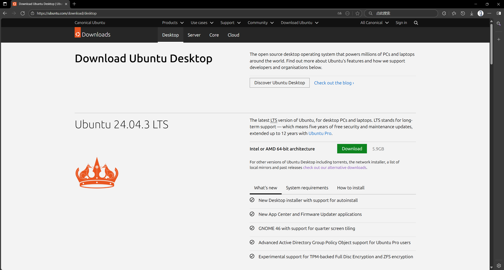

# 在Windows系统上搭建Ubuntu双系统

本攻略面向Windows用户（作者使用的是Win11），目的在于在已有Windows系统的电脑中分出磁盘的一块空间用于Ubuntu系统使用。

## 第零步：Why 双系统？

首先，使用linux并不是只有本地部署系统这一个路子，如果只是想要使用linux环境，你可以使用包括但不限于以下的方法：搭建linux虚拟机；使用云端服务器（北大同学可以免费使用的[Clab服务](https://clab.pku.edu.cn/)）；使用Windows自带的wsl服务。尤其是最新的wsl2，对于惯用Windows系统的同学来说非常友好，功能包括但不限于：与Windows无缝集成；随时方便切换系统；文件系统可以互相访问；计算资源占用少（相对本地搭建虚拟机而言）；使用和部署都相对简单。

而双系统具备诸多问题。首先是在两个系统来回切换时需要不断重启电脑，不够流畅丝滑，更无法同时使用两个系统进行工作，而且文件系统也不能互相访问。其次，在安装双系统的过程中，你需要进行**磁盘分区**操作，这是**有一定的风险性的**，操作不当可能会造成**数据丢失**，并且会占用你的相当一部分本地存储空间。

所以我建议你仔细考虑安装双系统的必要性，Ubuntu双系统一般可能具有以下用途：

1. 你真的想要一个独立的linux系统作为日常和工作生产使用
2. 你想要学习和处理linux系统的相当底层的操作
3. 你真的想要一个流畅稳定的linux的图形界面GUI
4. 你需要利用linux的硬件访问能力（因为wsl底层还是在Windows上运行的，不能直接触及底层硬件）
5. 你对性能要求极致，无法容忍虚拟机、wsl等其他方式引起的性能削减
6. 你的某些研究需要双系统的背景环境进行

如果你已经考虑好了装双系统的需求，那请继续阅读下文。

## 第一步：硬件和软件的准备

硬件上，我们需要一个Windows11系统的电脑（这不废话吗doge）、一块不小于8G存储空间的U盘，并且电脑里有最少几十G最多不封顶的空间可供于分配给Ubuntu系统使用。

我们首先去到[Ubuntu官网](https://ubuntu.com/download/desktop)，点击绿色的Download按钮（如下图），记好自己下载的.iso文件所在位置

然后我们需要使用Rufus工具用于制作安装盘，依然是[官网](https://rufus.ie/zh/)下载即可。

## 第二步：磁盘分区

然后我们开始进行磁盘分区。正如我在第零步所讲，操作不当可能有数据丢失风险，如有重要数据建议优先进行备份。

右键桌面的“此电脑”，“显示更多选项”，“管理”，进入到计算机管理的窗口界面。

施工中...