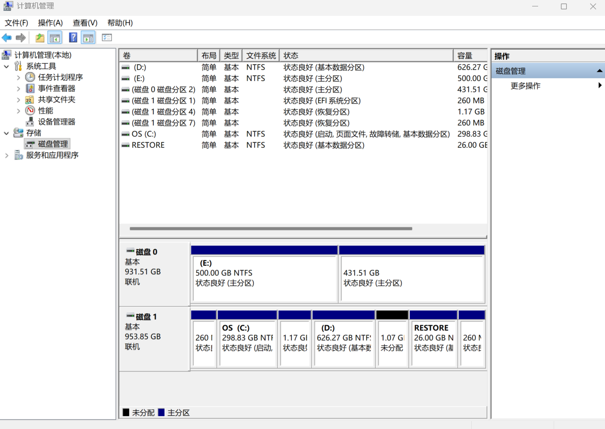
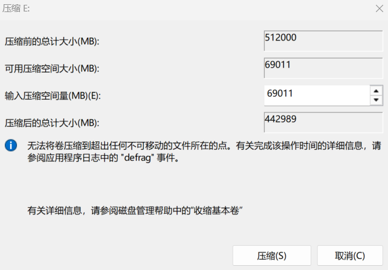

# 在Windows系统上搭建Ubuntu双系统

本攻略面向Windows用户（作者使用的是Win11），目的在于在已有Windows系统的电脑中分出磁盘的一块空间用于Ubuntu系统使用。

## 第零步：Why 双系统？

首先，使用linux并不是只有本地部署系统这一个路子，如果只是想要使用linux环境，你可以使用包括但不限于以下的方法：搭建linux虚拟机；使用云端服务器（北大同学可以免费使用的[Clab服务](https://clab.pku.edu.cn/)）；使用Windows自带的wsl服务。尤其是最新的wsl2，对于惯用Windows系统的同学来说非常友好，功能包括但不限于：与Windows无缝集成；随时方便切换系统；文件系统可以互相访问；计算资源占用少（相对本地搭建虚拟机而言）；使用和部署都相对简单。

而双系统具备诸多问题。首先是在两个系统来回切换时需要不断重启电脑，不够流畅丝滑，更无法同时使用两个系统进行工作，而且文件系统也不能互相访问。其次，在安装双系统的过程中，你需要进行**磁盘分区**操作，这是**有一定的风险性的**，操作不当可能会造成**数据丢失**，并且会占用你的相当一部分本地存储空间。

所以我建议你仔细考虑安装双系统的必要性，Ubuntu双系统一般可能具有以下用途：

1. 你真的想要一个独立的linux系统作为日常和工作生产使用
2. 你想要学习和处理linux系统的相当底层的操作
3. 你真的想要一个流畅稳定的linux的图形界面GUI
4. 你需要利用linux的硬件访问能力（因为wsl底层还是在Windows上运行的，不能直接触及底层硬件）
5. 你对性能要求极致，无法容忍虚拟机、wsl等其他方式引起的性能削减
6. 你的某些研究需要双系统的背景环境进行

如果你已经考虑好了装双系统的需求，那请继续阅读下文。

## 第一步：硬件和软件的准备

硬件上，我们需要一个Windows11系统的电脑（这不废话吗doge）、一块不小于8G存储空间的U盘（需要清空），并且电脑里有最少几十G最多不封顶的空间可供于分配给Ubuntu系统使用。

我们首先去到[Ubuntu官网](https://ubuntu.com/download/desktop)，点击绿色的Download按钮（如下图），记好自己下载的.iso文件所在位置

然后我们需要使用Rufus工具用于制作安装盘，依然是[官网](https://rufus.ie/zh/)下载即可。

## 第二步：磁盘分区

正如我在第零步所讲，操作不当可能有数据丢失风险，如有重要数据建议优先进行备份。

右键桌面的“此电脑”，“显示更多选项”，“管理”，进入到计算机管理的窗口界面。

点击磁盘管理，你大概会看到类似下方的界面。这里我是装了两个硬盘，其中下面的硬盘1就是系统盘，除了一些小分区以外整体上被我分为了两个区（盘符C和D）；上面的硬盘0中E也是个盘符，而另一部分就是我已经分配给Ubuntu的存储空间了。

接下来我们以我的E盘符为例，读者则使用自己预留出来的给Ubuntu的空间所在的盘区即可。右键这一盘区，点击“压缩卷”，修改下图中的第三项，这个数值就是你给Ubuntu的空间，学习测试用的话20G左右就够，自己正常使用的话还是多多益善，此外这个空间一旦设置死了之后**不易改变**，请提前想好相关设置！

压缩后你会发现你的原有盘符空间变少了，少出的部分变成了一部分“未分配”的空间。我们右键未分配的空间，点击“新建简单卷”，会进到一个新建简单卷的向导窗口，按照向导指示安装即可，指定卷大小的时候建议直接拉到最大（就是你刚刚压缩出的空间）。一路下一步直到完成之后，你会看到你的磁盘管理界面原来的“未分配”变成了拥有盘符的新盘区。

## 第三步：U盘制作

点开我们安装的Rufus工具，在设备选项中这样设置（从上到下，大多数都是保留默认值）：

1. 设备：选择你的U盘
2. 引导类型选择：点击右边的选择按钮，会进到路径界面，可以在这里找到你刚才下载的Ubuntu的.iso文件
3. 持久分区保留0即可
4. 分区类型选GPT
5. 目标系统类型选UEFI（非CSM）
6. 高级设备选项不用动
7. 卷标：在你选完设备之后大概会自动生成，大抵是叫Ubuntu某某某，这个不用动；如果没有自动生成的话就随便起个名就行，这是之后你的U盘名，而且之后也可以改
8. 文件系统：选择NTFS
9. 簇大小：选择默认即可
10. 高级格式化不用动

之后点击开始，蹦出来什么就点什么就行了。直到“状态”显示绿色底的“准备就绪”，去看一下你的U盘会发现它的名字已经变成你刚才设置的卷标了，内部也多了好多文件和文件夹。至此你的U盘就做好了

## 第四步：U盘启动

如果顺利的话，你只需要直接重启，或者弹出U盘+关机+插入U盘+开机，就会自动进到grub管理界面（并不是grub命令行界面）了，这一步就直接成功了，可以直接跳到第五步了。

但是！这一步是卡了作者最久的一步，作者在这一步失败了许多次，重启了更多次，并曾两度导致电脑差点开不了机，可谓是困难重重，到处是坑。如果你和我一样没能直接成功，请接着看下面的各种情况和设置，说不定会刚好解决你的问题。

### 如果进到的grub界面是命令行界面

问题不算严重，这大概是grub没能自动找到启动文件（即你的U盘），通过命令行手动告诉它就行了，步骤如下：

先找到你U盘的表示方式。命令行每行的开头应该是`grub>`提示符，我们先输入`ls`，回车后会看到不同盘不同分区的表示符号。接下来我们一个一个检验即可。比如你看到了一个分区叫做`(hd1,gpt1)`，那你就在命令行输入`ls (hd1,gpt1)/`，对所有分区进行这样的尝试直到你看见命令行返回了一堆包括`boot`、`efi`的文件夹，记住这个分区，这就是你的启动U盘。

接下来就是一堆启动参数的设置，这里我们以`(hd1,gpt1)`为例，具体内容需要你替换为你找到的那个分区。

首先设置根分区：`set root=(hd1,gpt1)`。然后加载Linux内核：`linux /casper/vmlinuz quiet splash`，如果失败了就试试换这句：`linux /casper/vmlinuz file=/cdrom/preseed/ubuntu.seed maybe-ubiquity quiet splash ---`。再然后加载初始内存盘（临时文件系统）：`initrd /casper/initrd`。最后输入`boot`回车，成功了的话你就看到Ubuntu安装界面了。

注意：根据版本不同，上述指令的路径可能有些细微的差别，导致你的路径在本地跑不正确。如果出现了这种情况，你在输入路径时，在每个斜杠后都可以按几下tab键，这会自动把路径填写上，可以帮你遍历找到名字类似的对应的文件夹路径。

成功进到Ubuntu安装界面后就可以直接去看第五步了，并且可以跳过第五步一开始的grub操作。

### 优先U盘启动

如果插着U盘的话，有不少电脑在开机时是默认从U盘优先启动的，但是有些并不是。你可以手动从U盘启动。首先要进入到蓝色的高级启动界面，方式有以下两种：

1. 你可以在开机时一直按住shift，按住不要松开，另一只手用鼠标点击重启。直到你的电脑关机之后就可以松开shift了，然后电脑重启会进到蓝色的高级启动界面。
2. 你可以按win键点开菜单，搜索“恢复选项”，进到设置界面，点击最下面恢复选项中“高级启动”模块的“立即重新启动”按钮，电脑重启后会进到蓝色的高级启动画面。

进到这一画面之后，点击“使用设备”，在里面找到你的U盘，大概的名字可能是“USB Drive 某某某”或类似，点击这个即可。如果你没找到这个，说明你和我一样遇到了更复杂的问题，请接着往下看；如果你找到并点击了这个，但是还是照常进到了Windows的界面中，那你也失败了，同上；如果你成功打开了一个标题叫做GRUB的黑框框界面，那你就成功了，可以跳转到下一步了。

### BIOS设置

看到这里说明你上一步U盘启动失败了。接下来的设置会越来越惊险，主板变砖不是问题（doge），所以一定谨慎操作，最好在修改某个设置的时候提前查一查这个东西有什么用，会造成什么结果。

首先你还是要进到蓝色的高级启动界面。点击“疑难解答”“高级选项”“UEFI固件设置”，即可进到BIOS界面。

由于BIOS界面无法截图，且就算拍屏，不同的主板的BIOS界面也大不相同，所以这里不做引导和展示了。

首先，如果你可以从这里直接设置优先启动项的话，就把USB的启动设置在windows manager启动之前，直接重启就好了

如果你找不到USB启动项和windows manager启动项并列，你要做的只有两件事：1，找到快速启动（Fast Boot）并关闭掉；2，找到安全启动（Secure Boot）并关闭掉（当然你可能关闭不掉，安全启动可能是灰的无法点击，如果真的是这样的话接着往下看）。有些主板（比如华硕）可能对修改安全启动的权限做了设置，导致你无法手动关闭，此时建议你在了解了你的主板是什么牌子的之后，自行查找主板关闭安全启动的方法，如果最终没能成功关闭安全启动了，那就不用管这一项了，因为这只是**可能**会影响我们U盘的启动，而非一定影响，更多的情况是没成功设置也可以正常启动和安装。

完成了这些设置之后，（我们先从好的讲）如果你重启后成功进到了一个标题叫做GRUB的黑框框界面，那你就成功了。

但是，如果你之后重启打不开电脑了（悲，那你和我遇到了同样的问题了。在确保电脑已经完全关机（如果卡黑屏很长时间关不了了就强行长按电源键关机）之后，查一下你电脑的主板对应的打开BIOS的快捷键（一般是delete或者f2，华硕主板一般是f2）按开机键并**立刻猛按F2**，直到看到打开了BIOS，去把所有你改动的设置全部改回去，或者直接“恢复默认设置”（还是先把电脑救活要紧），之后保存退出重启，原则上你的电脑应该回到从前、能够正常开机使用了。如果还是不能使用，那我很难过的告诉你，本文档暂时已经无法拯救你的电脑了，可以再问问AI、查查各种文档，还没救的话...

如果你的电脑没出问题或者出问题之后救回来了，但是也没成功进到GRUB界面，那我们继续。

### 更多其他的原因

恭喜你啊看到这一步了，你和我一样遇到了大量的问题，说不定还差点把电脑玩死了。你失败的原因可能还有很多，我只列举我遇到的和我能想到的问题和解决方案：

1. 或许你的U盘制作过程存在问题。你可以搜索一下Ubuntu的安装盘可能需要有的目录结构，或者最简单的方法就是格式化硬盘为空硬盘后再重新制作一个，重新尝试。
2. 或许你的U盘过于老旧或者存在故障（这是作者本人遇到的问题之一）。不要过于相信你那不知道从哪来的多少年的U盘了，换个新的确保好用的U盘或者移动硬盘重来一遍，说不定直接就成功了。
3. 如果你在BIOS设置阶段没能成功关闭掉Secure Boot，那或许是这个问题。安全启动某种程度上是将硬件绑定在Win系统的一种捆绑营销方式，有时可能会因此而阻止其他系统的安装和启动。如果你怀疑是这种情况的话，你可以着力去解决如何关闭安全启动这一问题。
4. 有的教程文档会推荐你在BIOS界面关闭VMD Controller，建议你慎重尝试，关闭这个功能可能能够解决Ubuntu识别不到硬盘的情况（其实也并非是我们当前遇到的困境），但是关闭这个功能会导致我们大概率无法启动Windows，最后会在开机启动界面循环（作者我的一次无法开机就是这样酿成的，试错成本还蛮高的...），解决方法还是和刚才BIOS设置中一样救电脑的操作一样**猛按快捷键**进到BIOS设置把VMD Controller改回来。
5. 更多其他原因。如果你遇到了问题欢迎下方评论区反馈，解决之后我会删评并添加到这里。

如果你还是没能成功安装双系统，建议你有条件的话更换机器，或者放弃安装双系统，如果你真的很急用双系统，你可以善用互联网查询更多攻略，或者询问联网的优质AI并详细告诉给AI你的电脑型号和相关硬件型号。

## 第五步：Ubuntu系统的初始化配置和运行

进到这一步，你就已经基本成功了，几乎不会有更多奇怪的问题了，按照步骤一直走就行了。

GRUB界面第一个选项一般就是安装Ubuntu（Try or Install Ubuntu），直接回车确认即可。随后会进到Ubuntu的安装配置界面。

先选择语言中文简体。下一步的“可访问性”可以大致看看，一般不用改。再下一步键盘布局使用中文或者英文美式都行。再下一步联网连不连都行，之后进到系统里也可以连。下一步选择“安装Ubuntu”，“交互安装”，安装的应用根据需求选择默认集合和拓展集合均可。

接下来的专有软件，如果你的电脑用了N卡或者你的电脑装了拓展屏之类的，建议勾选上“为图形和WIFI硬件安装第三方软件”。

然后进入如何安装界面，选择手动分区，找到你在第二步分区时分出的那个盘区（看内存大小应该能识别出来），点击选中，然后点左下角的减号（把分区从Win系统里扒出来），再点左下角的加号（把扒出来的分区分给Ubuntu），会跳出一个窗口，“大小”和“用于”都不用改，挂载点选择“/”，之后继续点下一步。

进到了设置账户界面，自己设置填写即可，再下一步的时区选择Shanghai时区即可，最后安装，等待一段时间之后就会安装完毕并建议重启，直接重启即可。

至此，你的Ubuntu系统就已经安装好了。

## 第六步：切换系统

之后你每次开机都会进到GRUB的黑框框界面，可以通过键盘的上下选择系统，其中“Ubuntu”就是刚刚我们安装的Ubuntu系统，“Windows Boot Manager”就是原有的Windows系统，上下选中后按回车即可进入对应系统了。

不过双系统可能会带来一些问题和改变，可能需要你自行处理解决或理解原因，包括但不限于以下这些：

- 从Ubuntu切换回Windows之后，可能会引起Windows系统的时间显示错误（具体就是你明明设置的是北京时间，即UTC+8:00，但是实际时间还是UTC时间）。这种情况也好处理，直接联网重新同步一下时间就行了。
- 在Win系统中看不到分出去的那部分硬盘存储空间。这是正常现象，你在Ubuntu系统那边可能还能看到Win系统管理的分区，但是在进行访问和修改的时候可能也会存在某些限制，这是双系统不共享存储空间的正常现象。
- 当你在选择进入系统的界面停留时间过长，会默认进入到Ubuntu系统。这个默认进入的优先级可以修改，修改方式也很容易，首先参考第四步的“BIOS设置”模块的方法进入到BIOS界面，然后在这里修改两种启动方式的先后顺序即可。
- 期待更多反馈

# 评论区
PS：评论之后，你的GitHub账号会在我的仓库的Issues模块留下评论，此时有可能会自动关注这条Issue，之后再有人有新的评论时，可能会向你GitHub账号的邮箱发送提醒。

如果你不想接收这一提醒，可以去到[我仓库的Issue界面](https://github.com/kuiningzzzz/kuiningzzzz.github.io/issues)，找到你评论所在区域对应的Issue，并点进去后在右下角的Notifications选项中取消掉Subscribe。

如果你想一劳永逸再也不自动订阅这一提醒，可以去你自己账号的Settings界面，点击左边Notifications，在右半Subscriptions中的Customize email updates中取消掉Comments on Issues选项并点击Save保存确定即可。

